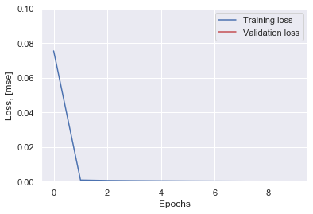

```python
import os
import random
import pandas as pd
import numpy as np
from sklearn import preprocessing
import seaborn as sns
sns.set(color_codes=True)
import matplotlib.pyplot as plt
%matplotlib inline
import random
from numpy.random import seed
from tensorflow import set_random_seed
import csv
from keras.layers import Input, Dropout
from keras.layers.core import Dense 
from keras.models import Model, Sequential, load_model
from keras import regularizers
from keras.models import model_from_json
seed(10)
set_random_seed(10)
```

    D:\Developer Tools\Anaconda\anaconda_core\lib\site-packages\tensorflow\python\framework\dtypes.py:526: FutureWarning: Passing (type, 1) or '1type' as a synonym of type is deprecated; in a future version of numpy, it will be understood as (type, (1,)) / '(1,)type'.
      _np_qint8 = np.dtype([("qint8", np.int8, 1)])
    D:\Developer Tools\Anaconda\anaconda_core\lib\site-packages\tensorflow\python\framework\dtypes.py:527: FutureWarning: Passing (type, 1) or '1type' as a synonym of type is deprecated; in a future version of numpy, it will be understood as (type, (1,)) / '(1,)type'.
      _np_quint8 = np.dtype([("quint8", np.uint8, 1)])
    D:\Developer Tools\Anaconda\anaconda_core\lib\site-packages\tensorflow\python\framework\dtypes.py:528: FutureWarning: Passing (type, 1) or '1type' as a synonym of type is deprecated; in a future version of numpy, it will be understood as (type, (1,)) / '(1,)type'.
      _np_qint16 = np.dtype([("qint16", np.int16, 1)])
    D:\Developer Tools\Anaconda\anaconda_core\lib\site-packages\tensorflow\python\framework\dtypes.py:529: FutureWarning: Passing (type, 1) or '1type' as a synonym of type is deprecated; in a future version of numpy, it will be understood as (type, (1,)) / '(1,)type'.
      _np_quint16 = np.dtype([("quint16", np.uint16, 1)])
    D:\Developer Tools\Anaconda\anaconda_core\lib\site-packages\tensorflow\python\framework\dtypes.py:530: FutureWarning: Passing (type, 1) or '1type' as a synonym of type is deprecated; in a future version of numpy, it will be understood as (type, (1,)) / '(1,)type'.
      _np_qint32 = np.dtype([("qint32", np.int32, 1)])
    D:\Developer Tools\Anaconda\anaconda_core\lib\site-packages\tensorflow\python\framework\dtypes.py:535: FutureWarning: Passing (type, 1) or '1type' as a synonym of type is deprecated; in a future version of numpy, it will be understood as (type, (1,)) / '(1,)type'.
      np_resource = np.dtype([("resource", np.ubyte, 1)])
    Using TensorFlow backend.
    


```python
data = pd.read_csv('rpm.csv')
data.columns = ['rpm', 'throotle']
data.head()

dataset_train = data[0:3000]
dataset_test = data[3000:]

scaler = preprocessing.MinMaxScaler()
data_scaler = pd.DataFrame(scaler.fit_transform(data), columns=data.columns, index=data.index)
scaler = preprocessing.MinMaxScaler()
X_train = pd.DataFrame(scaler.fit_transform(dataset_train), columns=dataset_train.columns, index=dataset_train.index)
X_train.sample(frac=1)
X_test = pd.DataFrame(scaler.transform(dataset_test),columns=dataset_test.columns,index=dataset_test.index)
```


```python

ACTIVATION = 'elu'

model=Sequential()
model.add(Dense(10,activation=ACTIVATION,kernel_initializer='glorot_uniform',kernel_regularizer=regularizers.l2(0.0),
                input_shape=(X_train.shape[1],)))

model.add(Dense(2,activation=ACTIVATION,kernel_initializer='glorot_uniform'))
model.add(Dense(10,activation=ACTIVATION,kernel_initializer='glorot_uniform'))
model.add(Dense(X_train.shape[1],kernel_initializer='glorot_uniform'))
model.compile(loss='mse',optimizer='adam')


NUM_EPOCHS=10
BATCH_SIZE=10

history=model.fit(np.array(X_train),np.array(X_train),
                  batch_size=BATCH_SIZE, 
                  epochs=NUM_EPOCHS,
                  validation_split=0.05,
                  verbose = 1)

plt.plot(history.history['loss'],'b',label='Training loss')
plt.plot(history.history['val_loss'],'r',label='Validation loss')
plt.legend(loc='upper right')
plt.xlabel('Epochs')
plt.ylabel('Loss, [mse]')
plt.ylim([0,.1])
plt.show()
```

    WARNING:tensorflow:From D:\Developer Tools\Anaconda\anaconda_core\lib\site-packages\tensorflow\python\ops\resource_variable_ops.py:435: colocate_with (from tensorflow.python.framework.ops) is deprecated and will be removed in a future version.
    Instructions for updating:
    Colocations handled automatically by placer.
    WARNING:tensorflow:From D:\Developer Tools\Anaconda\anaconda_core\lib\site-packages\tensorflow\python\ops\math_ops.py:3066: to_int32 (from tensorflow.python.ops.math_ops) is deprecated and will be removed in a future version.
    Instructions for updating:
    Use tf.cast instead.
    Train on 2850 samples, validate on 150 samples
    Epoch 1/10
    2850/2850 [==============================] - 1s 209us/step - loss: 0.0756 - val_loss: 1.6581e-04
    Epoch 2/10
    2850/2850 [==============================] - 0s 124us/step - loss: 9.0536e-04 - val_loss: 2.4497e-04
    Epoch 3/10
    2850/2850 [==============================] - 0s 171us/step - loss: 6.2893e-04 - val_loss: 1.9328e-04
    Epoch 4/10
    2850/2850 [==============================] - 0s 132us/step - loss: 5.1246e-04 - val_loss: 1.4607e-04
    Epoch 5/10
    2850/2850 [==============================] - 0s 123us/step - loss: 4.2345e-04 - val_loss: 1.6060e-04
    Epoch 6/10
    2850/2850 [==============================] - 0s 129us/step - loss: 3.5038e-04 - val_loss: 1.4428e-04
    Epoch 7/10
    2850/2850 [==============================] - 0s 126us/step - loss: 2.9738e-04 - val_loss: 9.6241e-05
    Epoch 8/10
    2850/2850 [==============================] - 0s 114us/step - loss: 2.5880e-04 - val_loss: 8.4643e-05
    Epoch 9/10
    2850/2850 [==============================] - 0s 119us/step - loss: 2.1886e-04 - val_loss: 6.5543e-05
    Epoch 10/10
    2850/2850 [==============================] - 0s 120us/step - loss: 1.8223e-04 - val_loss: 5.1382e-05
    





```python
X_pred = model.predict(np.array(X_train))
X_pred = pd.DataFrame(X_pred, 
                      columns=X_train.columns)
X_pred.index = X_train.index
scored = pd.DataFrame(index=X_train.index)
scored['Loss_mae'] = np.mean(np.abs(X_pred-X_train), axis = 1)
plt.figure()
sns.distplot(scored['Loss_mae'],bins = 10, kde= True,color = 'blue');
plt.xlim([0.0,.5])
```


    (0.0, 0.5)


```python
X_pred = model.predict(np.array(X_test))
X_pred = pd.DataFrame(X_pred, columns=X_test.columns)
X_pred.index = X_test.index

scored = pd.DataFrame(index=X_test.index)
scored['Error'] = np.mean(np.abs(X_pred-X_test), axis = 1)
scored['Threshold'] = 0.3
scored['Anomaly'] = scored['Error'] > scored['Threshold']
scored.head()
```


<div>
<style scoped>
    .dataframe tbody tr th:only-of-type {
        vertical-align: middle;
    }

    .dataframe tbody tr th {
        vertical-align: top;
    }

    .dataframe thead th {
        text-align: right;
    }
</style>
<table border="1" class="dataframe">
  <thead>
    <tr style="text-align: right;">
      <th></th>
      <th>Error</th>
      <th>Threshold</th>
      <th>Anomaly</th>
    </tr>
  </thead>
  <tbody>
    <tr>
      <th>3000</th>
      <td>0.009146</td>
      <td>0.3</td>
      <td>False</td>
    </tr>
    <tr>
      <th>3001</th>
      <td>0.009175</td>
      <td>0.3</td>
      <td>False</td>
    </tr>
    <tr>
      <th>3002</th>
      <td>0.009234</td>
      <td>0.3</td>
      <td>False</td>
    </tr>
    <tr>
      <th>3003</th>
      <td>0.009292</td>
      <td>0.3</td>
      <td>False</td>
    </tr>
    <tr>
      <th>3004</th>
      <td>0.009553</td>
      <td>0.3</td>
      <td>False</td>
    </tr>
  </tbody>
</table>
</div>


```python
X_pred_train = model.predict(np.array(X_train))
X_pred_train = pd.DataFrame(X_pred_train, 
                      columns=X_train.columns)
X_pred_train.index = X_train.index

scored_train = pd.DataFrame(index=X_train.index)
scored_train['Error'] = np.mean(np.abs(X_pred_train-X_train), axis = 1)
scored_train['Threshold'] = 0.3
scored_train['Anomaly'] = scored_train['Error'] > scored_train['Threshold']
scored = pd.concat([scored_train, scored])
```


```python
scored.plot(logy=True,  figsize = (10,6), ylim = [1e-5,1e5], color = ['blue','red'])
```


    <matplotlib.axes._subplots.AxesSubplot at 0x1f3e53db148>


